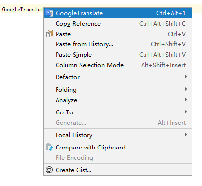
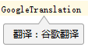
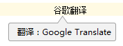
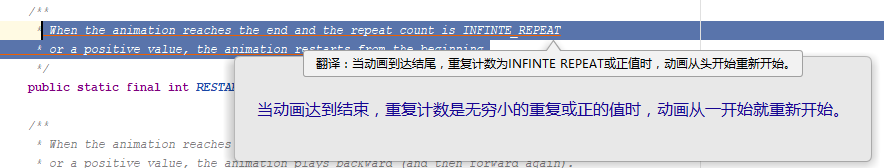
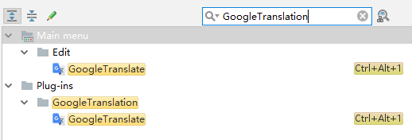

# GoogleTranslation

  
  
  
  

**插件基于以下项目：**
- [py-googletrans](https://github.com/ssut/py-googletrans)
- [translate-set](https://github.com/lsj9383/translate-set)
- [ECTranslation](https://github.com/Skykai521/ECTranslation)
- [TranslationPlugin](https://github.com/YiiGuxing/TranslationPlugin)

这个插件是利用[谷歌翻译](https://translate.google.com)的漏洞从而实现免费翻译的功能，所以说不准什么时候会被修复，不保证一直能用，漏洞详情请看[破解google翻译API全过程](http://www.cnblogs.com/by-dream/p/6554340.html)。

因为是利用漏洞所以不能像TranslationPlugin或者ECTranslation一样还能有释义等功能，从某种意义上来说它只是他们的补充（因为Google的翻译的确比有道等国内翻译API要好）。

## 安装

**使用 IDE 内置插件系统[审核中]:**
- <kbd>Preferences(Settings)</kbd> > <kbd>Plugins</kbd> > <kbd>Browse repositories...</kbd> > <kbd>搜索并找到"GoogleTranslation"</kbd> > <kbd>Install Plugin</kbd>

**手动:**
- 下载[`最新发布的插件包`](https://github.com/a483210/GoogleTranslation/releases/latest) -> <kbd>Preferences(Settings)</kbd> > <kbd>Plugins</kbd> > <kbd>Install plugin from disk...</kbd>

重启**IDE**.

## 使用

1. **翻译编辑器中的文本:**

   在编辑器中 <kbd>选择文本或者鼠标指向文本</kbd> > <kbd>单击鼠标右键</kbd> > <kbd>GoogleTranslate</kbd>

   

   或者使用快捷键<kbd>Ctrl + Alt + 1</kbd>进行翻译。

2. **自定义快捷键:**

   <kbd>Preferences(Settings)</kbd> > <kbd>Keymap</kbd> > <kbd>搜索GoogleTranslation</kbd>。在需要添加快捷键Action上 <kbd>右键</kbd> > <kbd>add Keyboard Shortcut...</kbd> 设置快捷键（按<kbd>ESC</kbd>键可关闭气泡）。

   
